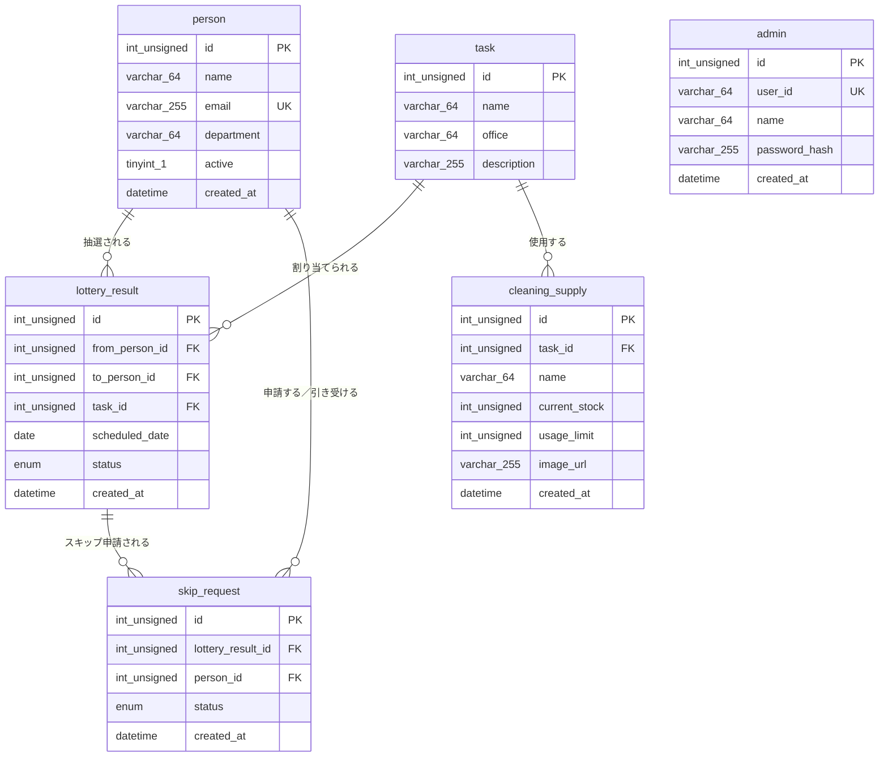

# テーブル定義書 — 社内掃除当番アプリ

| 項目 | 内容 |
|------|------|
| 対象システム | 社内掃除当番アプリ (hackason2026) |
| DBMS | MySQL 8.0 |
| データベース名 | `cleaning` |
| 定義ファイル | `webapp/sql/0_schema.sql` / `webapp/sql/1_seed.sql` |

## 1. テーブル一覧

| # | 物理名 | 論理名 | 概要 |
|---|--------|--------|------|
| 1 | `person` | 社員 | 掃除当番の割当対象となる社員 |
| 2 | `task` | 掃除タスク | Figmaの掃除場所画面に対応する掃除場所 |
| 3 | `skip_request` | スキップ申請 | 抽選結果に対するスキップ申請 |
| 4 | `lottery_result` | 抽選結果 | 社員と掃除タスクの抽選結果 |
| 5 | `cleaning_supply` | 掃除道具 | 掃除タスクで使用する道具の在庫・使用上限 |
| 6 | `admin` | 管理者 | ログイン可能な管理者アカウント |

`area` テーブルは削除した。掃除場所は `task` が管理する。

## 2. ER図

<!-- xlsx-image: images/er-diagram.png -->

## 3. テーブル定義

### 3.1 `person` (社員)

| 物理名 | 論理名 | 型 | NOT NULL | キー | 説明 |
|--------|--------|----|:--------:|------|------|
| `id` | 社員ID | `INT UNSIGNED` | ○ | PK | 社員を一意に識別するID |
| `name` | 氏名 | `VARCHAR(64)` | ○ | | 表示名 |
| `email` | メールアドレス | `VARCHAR(255)` | ○ | UK | 社内メールアドレス |
| `department` | 部署名 | `VARCHAR(64)` | ○ | | 所属部署 |
| `active` | 在籍フラグ | `TINYINT(1)` | ○ | | 抽選対象なら1 |
| `created_at` | 登録日時 | `DATETIME` | ○ | | 登録日時 |

### 3.2 `task` (掃除タスク)

掃除場所画面の項目に対応する。`office` で「東京オフィス」「大阪オフィス」などの拠点を保持する。

| 物理名 | 論理名 | 型 | NOT NULL | キー | 説明 |
|--------|--------|----|:--------:|------|------|
| `id` | 掃除タスクID | `INT UNSIGNED` | ○ | PK | 掃除タスクを識別するID |
| `name` | 掃除場所名 | `VARCHAR(64)` | ○ | | 会議室A、給湯室など |
| `office` | オフィス名 | `VARCHAR(64)` | ○ | | 掃除場所が属するオフィス |
| `description` | 作業内容 | `VARCHAR(255)` | ○ | | 掃除場所の説明 |

### 3.3 `lottery_result` (抽選結果)

| 物理名 | 論理名 | 型 | NOT NULL | キー | 説明 |
|--------|--------|----|:--------:|------|------|
| `id` | 抽選結果ID | `INT UNSIGNED` | ○ | PK | 抽選結果を識別するID |
| `person_id` | 社員ID | `INT UNSIGNED` | ○ | FK | `person.id` |
| `task_id` | 掃除タスクID | `INT UNSIGNED` | ○ | FK | `task.id` |
| `scheduled_date` | 実施予定日 | `DATE` | ○ | | 担当日 |
| `status` | 状態 | `ENUM('pending','done','swapped')` | ○ | | 抽選結果の進捗 |
| `created_at` | 登録日時 | `DATETIME` | ○ | | 登録日時 |

### 3.4 `skip_request` (スキップ申請)

| 物理名 | 論理名 | 型 | NOT NULL | キー | 説明 |
|--------|--------|----|:--------:|------|------|
| `id` | 申請ID | `INT UNSIGNED` | ○ | PK | 申請を識別するID |
| `lottery_result_id` | 抽選結果ID | `INT UNSIGNED` | ○ | FK | `lottery_result.id` |
| `from_person_id` | 申請元社員ID | `INT UNSIGNED` | ○ | FK | スキップを申請する社員。`person.id` |
| `to_person_id` | 申請先社員ID | `INT UNSIGNED` | ○ | FK | 交代を引き受ける社員。`person.id` |
| `status` | 申請状態 | `ENUM('pending','approved','rejected')` | ○ | | 承認状態 |
| `created_at` | 申請日時 | `DATETIME` | ○ | | 申請日時 |

### 3.5 `cleaning_supply` (掃除道具)

掃除道具詳細画面の「道具名」「現在庫」「使用上限」「使用状況」に対応する。

| 物理名 | 論理名 | 型 | NOT NULL | キー | 説明 |
|--------|--------|----|:--------:|------|------|
| `id` | 掃除道具ID | `INT UNSIGNED` | ○ | PK | 掃除道具を識別するID |
| `task_id` | 掃除タスクID | `INT UNSIGNED` | ○ | FK | 使用する掃除タスク |
| `name` | 道具名 | `VARCHAR(64)` | ○ | | モップ、洗剤など |
| `current_stock` | 現在庫 | `INT UNSIGNED` | ○ | | 現在の在庫数 |
| `usage_limit` | 使用上限 | `INT UNSIGNED` | ○ | | 使用上限数 |
| `image_url` | 画像URL | `VARCHAR(255)` | ○ | | 道具画像 |
| `created_at` | 登録日時 | `DATETIME` | ○ | | 登録日時 |

### 3.6 `admin` (管理者)

ログイン画面のユーザーID・パスワードと、管理画面に表示する管理者名を保持する。パスワードは平文ではなくハッシュ値を格納する。

| 物理名 | 論理名 | 型 | NOT NULL | キー | 説明 |
|--------|--------|----|:--------:|------|------|
| `id` | 管理者ID | `INT UNSIGNED` | ○ | PK | 管理者を識別するID |
| `user_id` | ユーザーID | `VARCHAR(64)` | ○ | UK | ログインID |
| `name` | 管理者名 | `VARCHAR(64)` | ○ | | 表示名 |
| `password_hash` | パスワードハッシュ | `VARCHAR(255)` | ○ | | ハッシュ化済みパスワード |
| `created_at` | 登録日時 | `DATETIME` | ○ | | 登録日時 |
