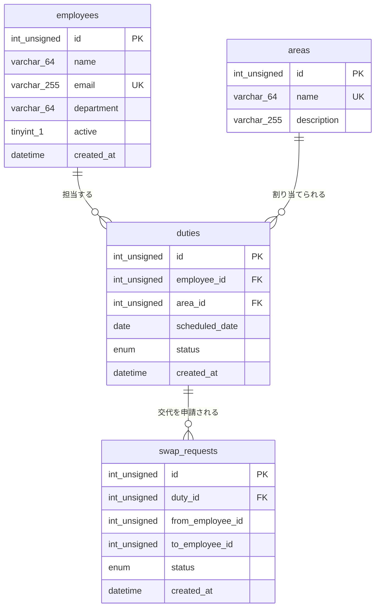

# テーブル定義書 — 社内掃除当番アプリ

| 項目 | 内容 |
|------|------|
| 対象システム | 社内掃除当番アプリ (hackason2026) |
| DBMS | MySQL 8.0 |
| データベース名 | `cleaning` |
| 文字セット / 照合順序 | `utf8mb4` / `utf8mb4_unicode_ci` |
| ストレージエンジン | InnoDB |
| タイムゾーン | `Asia/Tokyo` (db コンテナの `TZ`) |
| 定義ファイル | `webapp/sql/0_schema.sql` (スキーマ) / `webapp/sql/1_seed.sql` (初期データ) |
| 関連ドキュメント | [基本設計書](./basic-design.md) / [実装手順書](./implementation-guide.md) |

DDL は MySQL 公式イメージの `/docker-entrypoint-initdb.d` にマウントされ、**DB ボリュームが空の初回起動時のみ**自動実行される。再投入は `make seed` (volume 削除 → 再 up)。

---

## 1. テーブル一覧

| # | 物理名 | 論理名 | 概要 | 想定件数 |
|---|--------|--------|------|----------|
| 1 | `employees` | 社員 | 掃除当番の割当対象となる社員のマスタ | 約30件 |
| 2 | `areas` | 掃除エリア | 掃除対象箇所のマスタ | 約5件 |
| 3 | `duties` | 当番 | 「いつ・どのエリアを・誰が」担当するかの割当トランザクション | 週25件ずつ増加 |
| 4 | `swap_requests` | 交代申請 | 当番の交代依頼と承認状態 | 未使用 (下記 5. 参照) |

## 2. ER 図

<!-- xlsx-image: images/er-diagram.png -->

---

## 3. テーブル定義

### 3.1 `employees` (社員)

掃除当番の割当対象となる社員のマスタ。退職・休職等で対象外にする場合は行を削除せず `active = 0` にする。

| # | 物理名 | 論理名 | 型 | NOT NULL | 既定値 | キー | 説明 |
|---|--------|--------|----|:--------:|--------|------|------|
| 1 | `id` | 社員ID | `INT UNSIGNED` | ○ | AUTO_INCREMENT | PK | 社員を一意に識別する採番値 |
| 2 | `name` | 氏名 | `VARCHAR(64)` | ○ | — | | 表示名。姓名をスペース区切りで格納 (例: `佐藤 一郎`) |
| 3 | `email` | メールアドレス | `VARCHAR(255)` | ○ | — | UK | 社内メールアドレス。重複不可 |
| 4 | `department` | 部署名 | `VARCHAR(64)` | ○ | — | | 所属部署 (例: `開発部`)。正規化せず文字列で保持 |
| 5 | `active` | 在籍フラグ | `TINYINT(1)` | ○ | `1` | | `1`=当番割当対象 / `0`=対象外 |
| 6 | `created_at` | 登録日時 | `DATETIME` | ○ | `CURRENT_TIMESTAMP` | | レコード作成日時 |

**キー / インデックス**

| 種別 | 名称 | 対象カラム | 説明 |
|------|------|-----------|------|
| PRIMARY | — | `id` | |
| UNIQUE | `uq_employees_email` | `email` | メールアドレスの重複登録を防止 |

**業務ルール**

- 当番生成 (`POST /api/duties/generate`) の抽選母集団は `WHERE active = 1` で絞り込む。
- `GET /api/employees` は `active` を boolean に変換して返す。

---

### 3.2 `areas` (掃除エリア)

掃除対象箇所のマスタ。1日あたり全エリアに1名ずつ当番が割り当てられるため、**エリア件数 = 1日あたりの当番件数**となる。

| # | 物理名 | 論理名 | 型 | NOT NULL | 既定値 | キー | 説明 |
|---|--------|--------|----|:--------:|--------|------|------|
| 1 | `id` | エリアID | `INT UNSIGNED` | ○ | AUTO_INCREMENT | PK | エリアを一意に識別する採番値 |
| 2 | `name` | エリア名 | `VARCHAR(64)` | ○ | — | UK | 掃除箇所の名称 (例: `会議室A`) |
| 3 | `description` | 作業内容 | `VARCHAR(255)` | ○ | `''` (空文字) | | そのエリアで行う清掃作業の説明 |

**キー / インデックス**

| 種別 | 名称 | 対象カラム | 説明 |
|------|------|-----------|------|
| PRIMARY | — | `id` | |
| UNIQUE | `uq_areas_name` | `name` | 同名エリアの重複登録を防止 |

**業務ルール**

- `description` は NULL 不可・既定値は空文字。未入力を NULL ではなく空文字で表現する。

---

### 3.3 `duties` (当番)

「いつ・どのエリアを・誰が担当するか」を1行で表すトランザクションテーブル。

| # | 物理名 | 論理名 | 型 | NOT NULL | 既定値 | キー | 説明 |
|---|--------|--------|----|:--------:|--------|------|------|
| 1 | `id` | 当番ID | `INT UNSIGNED` | ○ | AUTO_INCREMENT | PK | 当番を一意に識別する採番値 |
| 2 | `employee_id` | 社員ID | `INT UNSIGNED` | ○ | — | FK → `employees.id` | 担当する社員 |
| 3 | `area_id` | エリアID | `INT UNSIGNED` | ○ | — | FK → `areas.id` | 担当する掃除エリア |
| 4 | `scheduled_date` | 実施予定日 | `DATE` | ○ | — | | 当番を実施する日付 (時刻は保持しない) |
| 5 | `status` | 状態 | `ENUM('pending','done','swapped')` | ○ | `'pending'` | | 当番の進捗状態。下表参照 |
| 6 | `created_at` | 登録日時 | `DATETIME` | ○ | `CURRENT_TIMESTAMP` | | レコード作成日時 |

**`status` の値**

| 値 | 意味 | 遷移させる契機 |
|----|------|----------------|
| `pending` | 未実施 | 当番生成時の初期値 |
| `done` | 実施済み | 完了報告 (**API 未実装**) |
| `swapped` | 他者へ交代済み | 交代申請の承認 (**API 未実装**) |

**キー / インデックス**

| 種別 | 名称 | 対象カラム | 説明 |
|------|------|-----------|------|
| PRIMARY | — | `id` | |
| INDEX | `idx_duties_date` | `scheduled_date` | 日付順一覧・期間絞り込み用 |
| INDEX | `idx_duties_employee` | `employee_id` | 社員別の当番履歴参照用 |
| FOREIGN KEY | `fk_duties_emp` | `employee_id` → `employees.id` | ON DELETE / ON UPDATE は既定 (`RESTRICT`) |
| FOREIGN KEY | `fk_duties_area` | `area_id` → `areas.id` | ON DELETE / ON UPDATE は既定 (`RESTRICT`) |

**業務ルール**

- 一覧取得は `employees` / `areas` と INNER JOIN し、`ORDER BY scheduled_date, areas.id` で返す。
- 生成 API は既存レコードを削除せず **追記のみ** 行う。同一日・同一エリアに対する一意制約は張っていないため、生成 API を複数回実行すると同じ日付・エリアの当番が重複して登録される。
- FK が `RESTRICT` のため、当番が紐づく社員・エリアは削除できない (Ruby 側モデルも `dependent: :restrict_with_exception`)。

---

### 3.4 `swap_requests` (交代申請)

当番の交代依頼とその承認状態を保持する。**スキーマのみ定義されており、現時点でどのバックエンド実装からも参照されていない** (将来の交代機能用の先行定義)。

| # | 物理名 | 論理名 | 型 | NOT NULL | 既定値 | キー | 説明 |
|---|--------|--------|----|:--------:|--------|------|------|
| 1 | `id` | 申請ID | `INT UNSIGNED` | ○ | AUTO_INCREMENT | PK | 申請を一意に識別する採番値 |
| 2 | `duty_id` | 当番ID | `INT UNSIGNED` | ○ | — | FK → `duties.id` | 交代対象の当番 |
| 3 | `from_employee_id` | 依頼元社員ID | `INT UNSIGNED` | ○ | — | | 交代を依頼する社員。**FK 制約なし** |
| 4 | `to_employee_id` | 依頼先社員ID | `INT UNSIGNED` | ○ | — | | 交代を引き受ける社員。**FK 制約なし** |
| 5 | `status` | 申請状態 | `ENUM('pending','approved','rejected')` | ○ | `'pending'` | | `pending`=承認待ち / `approved`=承認済 / `rejected`=却下 |
| 6 | `created_at` | 申請日時 | `DATETIME` | ○ | `CURRENT_TIMESTAMP` | | レコード作成日時 |

**キー / インデックス**

| 種別 | 名称 | 対象カラム | 説明 |
|------|------|-----------|------|
| PRIMARY | — | `id` | |
| INDEX | `idx_swap_duty` | `duty_id` | 当番に紐づく申請の参照用 |
| FOREIGN KEY | `fk_swap_duty` | `duty_id` → `duties.id` | ON DELETE / ON UPDATE は既定 (`RESTRICT`) |

**留意点**

- `from_employee_id` / `to_employee_id` には FK 制約が定義されていないため、存在しない社員 ID を登録できてしまう。実装時は FK 追加を検討すること。
- 申請が `approved` になった際に `duties.employee_id` を書き換えるのか、`duties.status` を `swapped` にして別レコードを作るのかは未定義。

---

## 4. 初期データ (`webapp/sql/1_seed.sql`)

| テーブル | 件数 | 内容 |
|----------|------|------|
| `areas` | 5件 | 会議室A / 会議室B / 休憩スペース / トイレ / エントランス (ID を明示指定) |
| `employees` | 30件 | 営業部・開発部・人事部・経理部・総務部・法務部・広報部・マーケ部・情シスの9部署。全員 `active = 1` |
| `duties` | 25件 | 本日から4日後までの5日間 × 5エリア。`CURDATE() + INTERVAL n DAY` で相対日付として投入。担当は社員ID 1〜25 のラウンドロビン。全件 `pending` |
| `swap_requests` | 0件 | 投入なし |

`duties` の日付は投入時点の `CURDATE()` 基準で確定するため、DB を初期化した日によって値が変わる。

---

## 5. 現行実装との差分・今後の課題

| 項目 | 現状 | 備考 |
|------|------|------|
| `swap_requests` の利用 | テーブルのみ存在。API・モデルとも未実装 | 交代機能の実装時に併せて FK 追加を検討 |
| `duties.status` の更新 | `pending` のまま更新する手段がない | `PATCH /api/duties/:id` 等の追加が必要 |
| `duties` の重複防止 | 一意制約なし | `(scheduled_date, area_id)` の UNIQUE 追加が候補 |
| 社員・エリアの登録/更新 | 参照系 API のみ。登録は seed SQL または Adminer 経由 | |
| 監査項目 | `updated_at` を持つテーブルがない | 更新系 API を追加する際に検討 |
